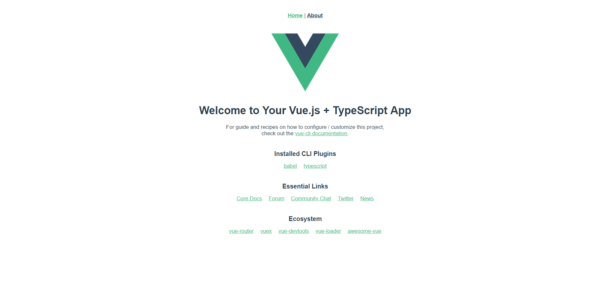

# vue-typescript-started

vue-typescript 模板：



## Project setup
```
yarn install
```

### Compiles and hot-reloads for development
```
yarn run serve
```

### Compiles and minifies for production
```
yarn run build
```

### Lints and fixes files
```
yarn run lint
```

参考:

https://cli.vuejs.org/guide/plugins-and-presets.html

QQ交流群：144281548
